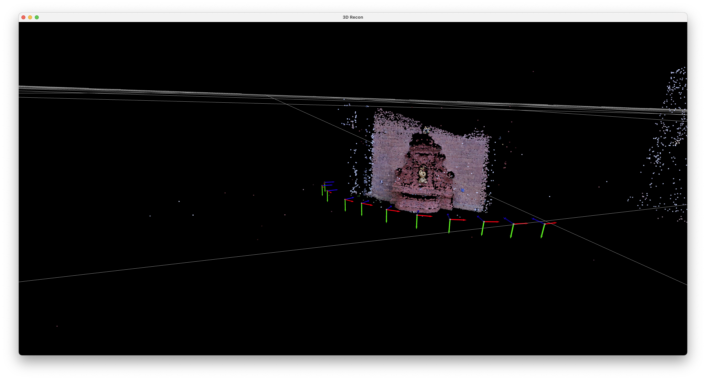
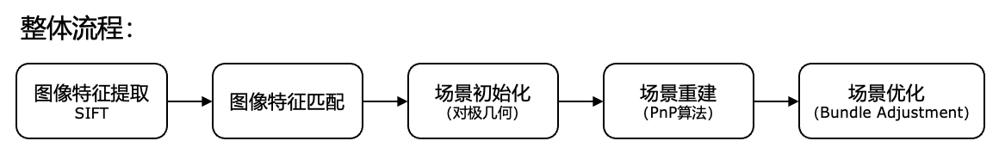

<!--
 * @Author: huskydoge hbh001098hbh@sjtu.edu.cn
 * @Date: 2024-04-30 21:14:14
 * @LastEditors: huskydoge hbh001098hbh@sjtu.edu.cn
 * @LastEditTime: 2024-05-07 21:49:41
 * @FilePath: /code/README.md
 * @Description: 这是默认设置,请设置`customMade`, 打开koroFileHeader查看配置 进行设置: https://github.com/OBKoro1/koro1FileHeader/wiki/%E9%85%8D%E7%BD%AE
-->

# AI4701-ComputerVision-3D-Recon Final Project





## setup

```shell
pip install -r requirements.txt
```

## overview

`images/`: 11 张图像，0000 作为世界坐标系。

`main.py`: 主函数

`config/config.yaml`: 配置文件

```yaml
GLOB:
  intrinsic_path: camera_intrinsic.txt
  world_cam_path: images/0000.png
  save_dir: output

RECON_INIT:
  camera_paths: [images/0000.png, images/0001.png]

RECON:
  method: epipolar # pnp or epipolar
  visualize: True
  merge_3d: False
  normalize_epi: True # whether scale the transition vector derived from epipolar, 否则会有尺度问题

ESTIMATOR:
  alg: ransac # ransac, magsac, use in findEssentialMat, findFundamentalMat, not in match
  ransac_params:
    ransacReprojThreshold: 0.1
    confidence: 0.99
  extract:
    contrast_thresh: 0.001 # Threshold for keypoint selection based on contrast. Lower values increase feature count but reduce stability.
    edge_thresh: 10 # Threshold for eliminating edge responses in keypoints, lower value tends to ignore more features near edges, thereby reducing mismatches caused by edges
    sigma: 1.6
  match:
    thres: 0.5
    alg: None # ransac, magsac, None
    ransac_params:
      ransacReprojThreshold: 10
      confidence: 0.99
    tree: 7 # 配置索引，密度树的数量为5
    checks: 50 # 指定递归次数
    flan_k: 2 # 最近邻的数量，=2,表示寻找两个最近邻，一般不动

BA:
  least_square_params:
    method: trf # trf or lm
    ftol: 1e-8
```

`src/`

- `feature_extraction.py` : SIFT 图像特征提取
- `feature_matching.py` : FLAN 图像特征匹配
- `initial_recon.py` : 对极几何 三维场景初始化
- `pnp_recon.py` : PnP 方法三维重建
- `bundle_adjustment.py`: BA 优化
- `epipolar_recon.py` : 仅用对极几何进行三维重建
- `utils.py`: 工具

`outputs/` : 输出路径

---

报告中各实验结果下载 (5.35GB) ：https://pan.baidu.com/s/1U2KEm_XWg_psUyz6p5gW3Q?pwd=a943 提取码: a943

解压到 `outputs/` 下
